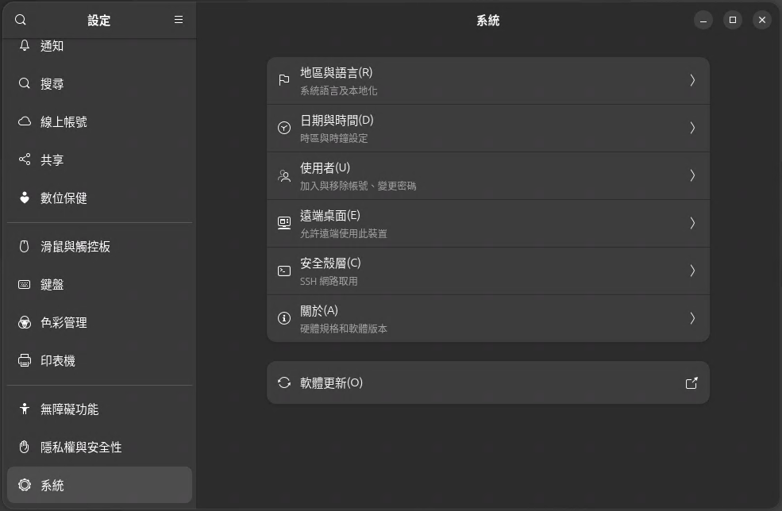
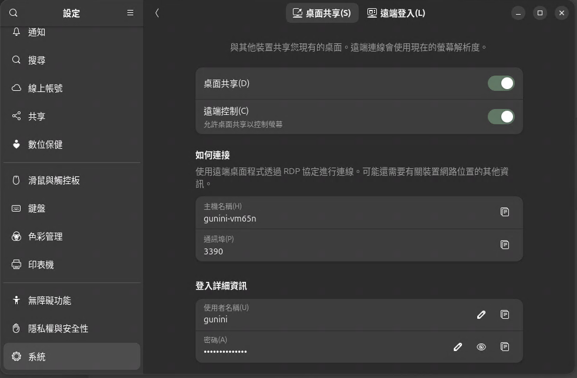
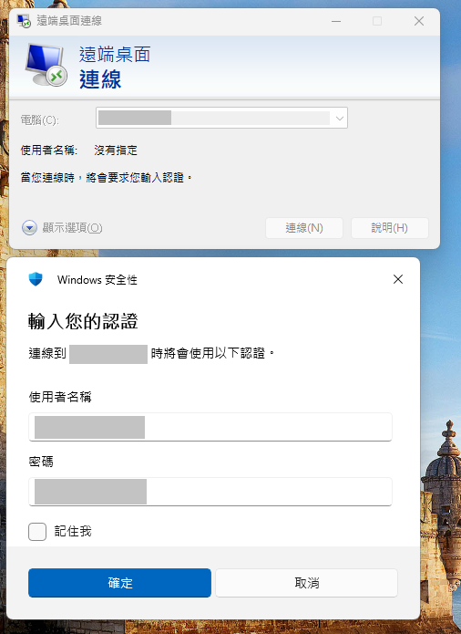
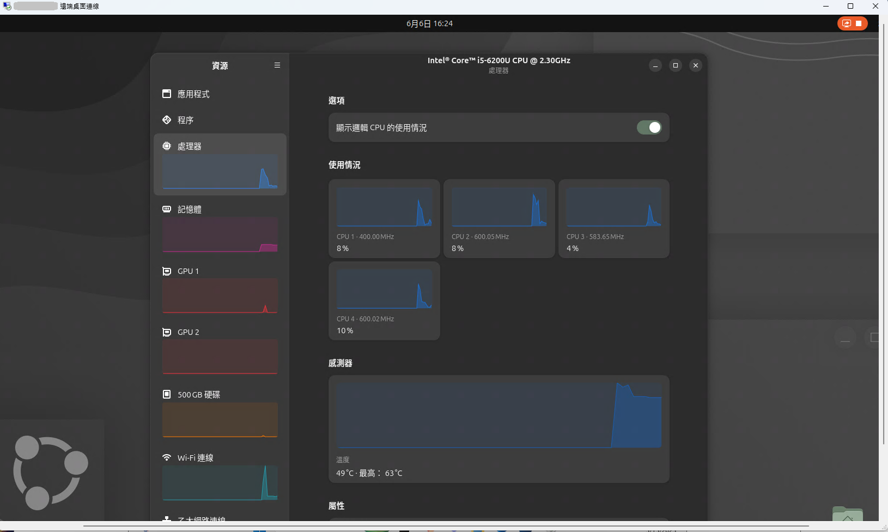
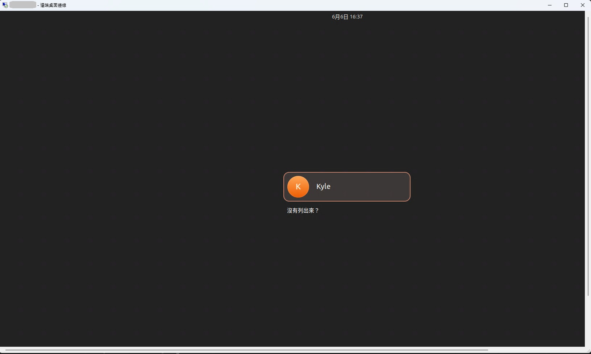
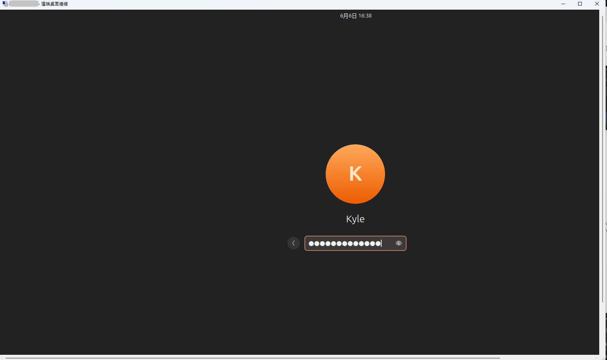
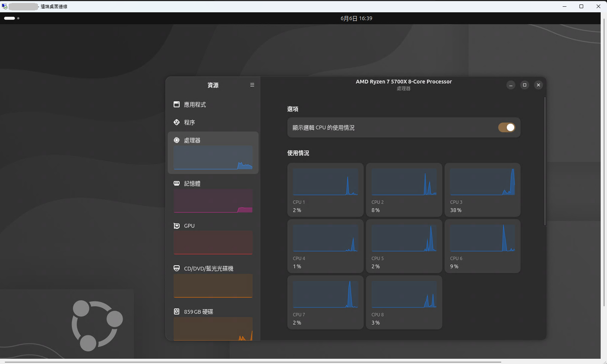

<h3 style="color: #930000;">GNOME 遠端桌面</h3>
<p style="font-size: 90%">設定 GNOME 遠端桌面服務，並啟用從用戶端電腦的遠端連線。</p>
<p style="font-size: 90%">[1]	如果已安裝 GNOME 桌面，則安裝<a href="https://www.server-world.info/en/note?os=Ubuntu_24.04&p=desktop&f=1">相依套件</a>；但如果未安裝，請按以下方式安裝。 </p>

```sh
# 如果已安裝 GNOME 桌面
root@ub-26-dv:~# apt -y install ubuntu-desktop task-gnome-desktop
root@ub-26-dv:~# reboot

# 未安裝，請按以下方式安裝
root@ub-26-dv:~# apt -y install gnome-remote-desktop
```

<p style="font-size: 90%">[2]	
如果要為每個使用者啟用遠端桌面，請登入桌面並如下進行設定。<br>
但是，如果設定該設定的使用者登出，則 RDP 連接埠將不再監聽。<br><br>
開啟【設定】-【系統】-【遠端桌面】，然後會顯示下列畫面。<br>
在此處啟用【桌面共用】和【遠端控制】。<br><br>
連接埠設定為預設的 RDP 連接埠 [3389]，但如果其他使用者已在使用該端口，請將其變更為其他連接埠。<br>
在「登入使用者名稱和密碼」部分，設定 RDP 連線的使用者名稱和密碼。<br><br>
<br>
<br>
</p>
<p style="font-size: 90%">[3] 從使用者端電腦建立的連線。這裡以 Windows 11 為例。<br>
啟動遠端桌面連線並連線後，螢幕上會顯示使用者名稱和密碼輸入框。<br>
請輸入您在 [3] 中設定的使用者名稱和密碼。<br>
<br>
</p>
<p style="font-size: 90%">[4] 身份驗證成功，將顯示遠端桌面螢幕。<br>
<br>
</p>
<p style="font-size: 90%">[5]	若要啟用具有 root 權限的遠端桌面，請如下設定。<br>
在這種情況下，每個使用者連接遠端桌面服務的使用者名稱和密碼都相同，連線後，將顯示正常的登入介面，每個使用者使用自己的作業系統使用者名稱和密碼登入。<br>
</p>

```sh
# create certificate
root@ub-26-dv:~# mkdir -p /var/lib/gnome-remote-desktop/.local/share/gnome-remote-desktop
root@ub-26-dv:~# cd /var/lib/gnome-remote-desktop/.local/share/gnome-remote-desktop
root@ub-26-dv:/var/lib/gnome-remote-desktop/.local/share/gnome-remote-desktop# openssl req -new -x509 -nodes -newkey ec:<(openssl ecparam -name secp384r1) -keyout tls.key -out tls.crt -days 3650
-----
You are about to be asked to enter information that will be incorporated
into your certificate request.
What you are about to enter is what is called a Distinguished Name or a DN.
There are quite a few fields but you can leave some blank
For some fields there will be a default value,
If you enter '.', the field will be left blank.
-----
Country Name (2 letter code) [XX]:JP
State or Province Name (full name) []:Hiroshima
Locality Name (eg, city) [Default City]:Hiroshima
Organization Name (eg, company) [Default Company Ltd]:GTS
Organizational Unit Name (eg, section) []:Server World
Common Name (eg, your name or your server's hostname) []:dlp.srv.world
Email Address []:root@srv.world

root@ub-26-dv:/var/lib/gnome-remote-desktop/.local/share/gnome-remote-desktop# chown -R gnome-remote-desktop:gnome-remote-desktop /var/lib/gnome-remote-desktop/.local
root@ub-26-dv:/var/lib/gnome-remote-desktop/.local/share/gnome-remote-desktop# cd
# Enable RDP
# [Init TPM credentials ***] message is no problem
# it appears on older computers that do not have a TPM device
root@ub-26-dv:~# grdctl --system rdp set-tls-key /var/lib/gnome-remote-desktop/.local/share/gnome-remote-desktop/tls.key
Init TPM credentials failed because No TPM device found, using GKeyFile as fallback.
root@ub-26-dv:~# grdctl --system rdp set-tls-cert /var/lib/gnome-remote-desktop/.local/share/gnome-remote-desktop/tls.crt
# set a user for RDP connection
# set-credentials [any username you like] [password]
root@ub-26-dv:~# grdctl --system rdp set-credentials rdpuser password
root@ub-26-dv:~# grdctl --system rdp enable
root@ub-26-dv:~# grdctl --system status
Init TPM credentials failed because No TPM device found, using GKeyFile as fallback.
Overall:
        Unit status: active
RDP:
        Status: enabled
        Port: 3389
        TLS certificate: /var/lib/gnome-remote-desktop/.local/share/gnome-remote-desktop/tls.crt
        TLS fingerprint: b5:73:d5:63:83:9a:09:d5:89:75:e7:39:51:dd:2a:7c:41:c5:d0:35:ad:41:5e:fe:45:c6:94:05:2e:0b:30:75
        TLS key: /var/lib/gnome-remote-desktop/.local/share/gnome-remote-desktop/tls.key
        Username: (hidden)
        Password: (hidden)

root@ub-26-dv:~# systemctl daemon-reload
root@ub-26-dv:~# systemctl restart gnome-remote-desktop
```

<p style="font-size: 90%">[6]	這是從客戶端電腦建立的連線。這裡以 Windows 11 為例。<br>
啟動遠端桌面連線並連線後，螢幕上會顯示使用者名稱和密碼輸入框。<br>
請輸入您在 [5] 中設定的 RDP 連線使用者名稱和密碼。<br>
<br>
</p>

<p style="font-size: 90%">[7]	如果遠端桌面連線成功，將顯示登入介面。<br>
請使用您的作業系統使用者帳號登入。登入後，操作與正常的遠端桌面操作相同。<br>
<br>
<br>
<br>
</p>

#### + reference +
<ol>
<li><a href="https://www.server-world.info/en/note?os=Ubuntu_24.04&p=desktop&f=11" target="_blank">Desktop Environment : GNOME Remote Desktop</a></li>
<li><a href="https://www.server-world.info/en/note?os=Ubuntu_24.04&p=desktop&f=1" target="_blank">Desktop Environment : GNOME Desktop</a></li>
<li><a href="" target="_blank"></a></li>
</ol>