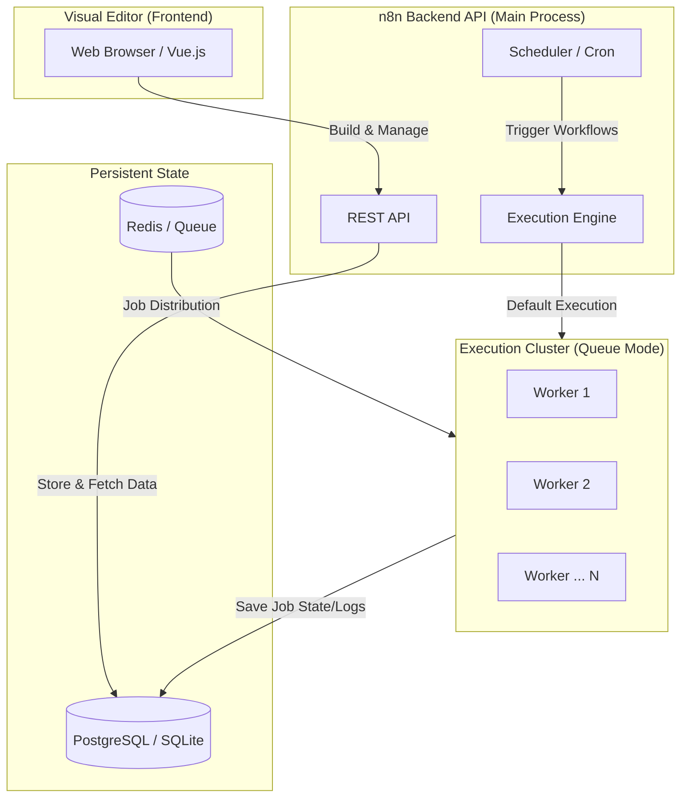

#### 使用 Docker 部署 n8n 套件
#### 1. 建立一個 ```.env``` 文件
建立一個專案目錄來儲存您的 n8n 環境配置和 Docker Compose 文件，並進入該目錄：
```sh
mkdir n8n-compose
cd n8n-compose
```
在目錄下 ```n8n-compose``` 建立一個 ```.env``` 文件，用於自訂您的 n8n 實例的詳細資訊。將其修改為與您自己的資訊相符：
```ini
# .env file
# DOMAIN_NAME and SUBDOMAIN together determine where n8n will be reachable from
# The top level domain to serve from
DOMAIN_NAME=example.com

# The subdomain to serve from
SUBDOMAIN=n8n

# The above example serve n8n at: https://n8n.example.com

# Optional timezone to set which gets used by Cron and other scheduling nodes
# New York is the default value if not set
GENERIC_TIMEZONE=Asia/Taipei

# The email address to use for the TLS/SSL certificate creation
SSL_EMAIL=user@example.com
```
#### 2. 建立本機檔案目錄
專案目錄中，建立一個名為 ```local-files``` 的目錄，用於在 n8n 實例和主機系統之間共用檔案（例如，使用「從磁碟讀取/寫入檔案」節點）：
```sh
mkdir local-files
```

下面的 Docker Compose 檔案可以自動建立此目錄，但手動建立可確保以正確的所有權和權限建立目錄。

#### 3. 建立 Docker Bridge 網路
```sh
sudo docker create network web-app-bridge
```

#### 4.  建立 Docker Compose 文件
建立一個 ```docker-compose.yaml``` 文件。將以下內容貼到該文件中：
```yaml
# docker-compose.yaml file
services:
  traefik:
    image: "traefik"
    container_name: traefik
    restart: always
    command:
      - "--api.insecure=true"
      - "--providers.docker=true"
      - "--providers.docker.exposedbydefault=false"
      - "--entrypoints.web.address=:80"
      - "--entrypoints.web.http.redirections.entryPoint.to=websecure"
      - "--entrypoints.web.http.redirections.entrypoint.scheme=https"
      - "--entrypoints.websecure.address=:443"
      - "--certificatesresolvers.mytlschallenge.acme.tlschallenge=true"
      - "--certificatesresolvers.mytlschallenge.acme.email=${SSL_EMAIL}"
      - "--certificatesresolvers.mytlschallenge.acme.storage=/letsencrypt/acme.json"
    ports:
      #- "80:80"
      #- "443:443"
      - ${TRAEFIK_PORT_80-80}:80
      - ${TRAEFIK_PORT_443-443}:443
    volumes:
      - traefik_data:/letsencrypt
      - /var/run/docker.sock:/var/run/docker.sock:ro
    networks:
      - web-app-bridge

  n8n:
    image: docker.n8n.io/n8nio/n8n:latest
    container_name: n8n
    restart: always
    ports:
      #- "127.0.0.1:5678:5678"
      - ${N8N_WEBAPI_PORT-5678}:5678
    labels:
      - traefik.enable=true
      - traefik.http.routers.n8n.rule=Host(`${SUBDOMAIN}.${DOMAIN_NAME}`)
      - traefik.http.routers.n8n.tls=true
      - traefik.http.routers.n8n.entrypoints=web,websecure
      - traefik.http.routers.n8n.tls.certresolver=mytlschallenge
      - traefik.http.middlewares.n8n.headers.SSLRedirect=true
      - traefik.http.middlewares.n8n.headers.STSSeconds=315360000
      - traefik.http.middlewares.n8n.headers.browserXSSFilter=true
      - traefik.http.middlewares.n8n.headers.contentTypeNosniff=true
      - traefik.http.middlewares.n8n.headers.forceSTSHeader=true
      - traefik.http.middlewares.n8n.headers.SSLHost=${DOMAIN_NAME}
      - traefik.http.middlewares.n8n.headers.STSIncludeSubdomains=true
      - traefik.http.middlewares.n8n.headers.STSPreload=true
      - traefik.http.routers.n8n.middlewares=n8n@docker
    environment:
      - N8N_ENFORCE_SETTINGS_FILE_PERMISSIONS=true
      - N8N_HOST=${SUBDOMAIN}.${DOMAIN_NAME}
      - N8N_PORT=5678
      - N8N_PROTOCOL=https  
      - NODE_ENV=production
      - WEBHOOK_URL=https://${SUBDOMAIN}.${DOMAIN_NAME}/
      - GENERIC_TIMEZONE=${GENERIC_TIMEZONE}
      - TZ=${GENERIC_TIMEZONE}
    volumes:
      - n8n_data:/home/node/.n8n
      - ./local-files:/files
    depends_on:
      - ollama
    extra_hosts:
      - host.docker.internal:host-gateway
    networks:
      - web-app-bridge

volumes:
  n8n_data: {}
  traefik_data: {}

networks:
  web-app-bridge:
    external: true
```

#### 5. 使用 docker-compose 啟動 n8n 容器服務
```sh
sudo docker compose up -d
```

#### 6. 使用 docker-compose 更新 n8n 容器服務
```sh
# 1. Pull updated image
sudo docker compose pull

# 2. Recreate containers
sudo docker compose up -d

# 3. Prune Old Images
sudo docker image prune -f
```

#### + 架構圖 +
**Core n8n Architecture**



#### + reference +
<ol>
<li><a href="https://docs.n8n.io/hosting/installation/server-setups/docker-compose/" target="_blank">Hosting n8n Docker-Compose</a></li>
<li><a href="https://github.com/n8n-io/n8n" target="_blank">n8n - Secure Workflow Automation for Technical Teams</a></li>
</ol>
