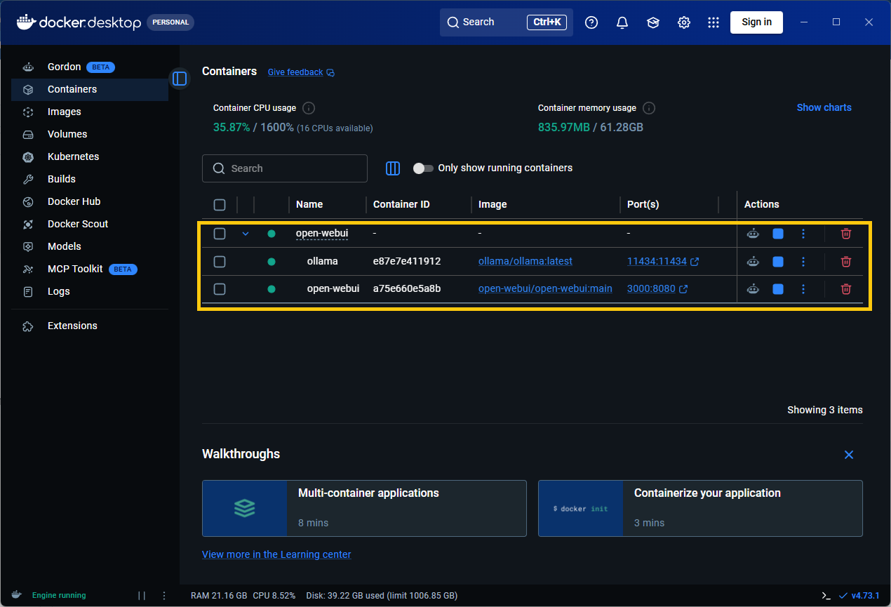
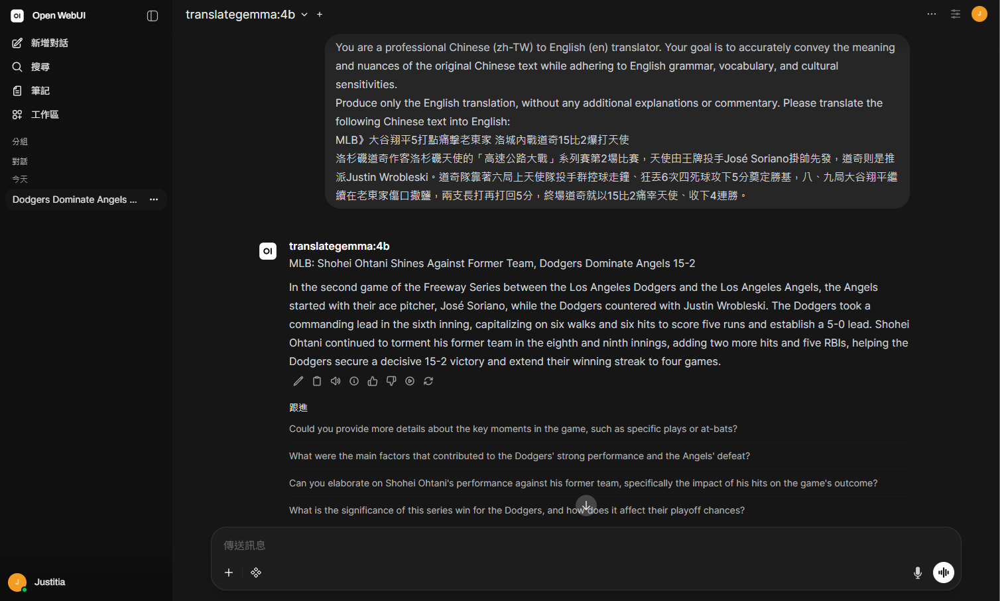
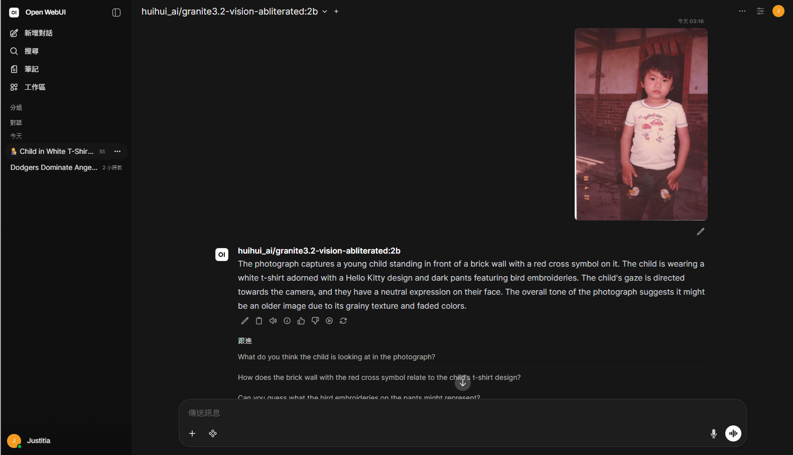
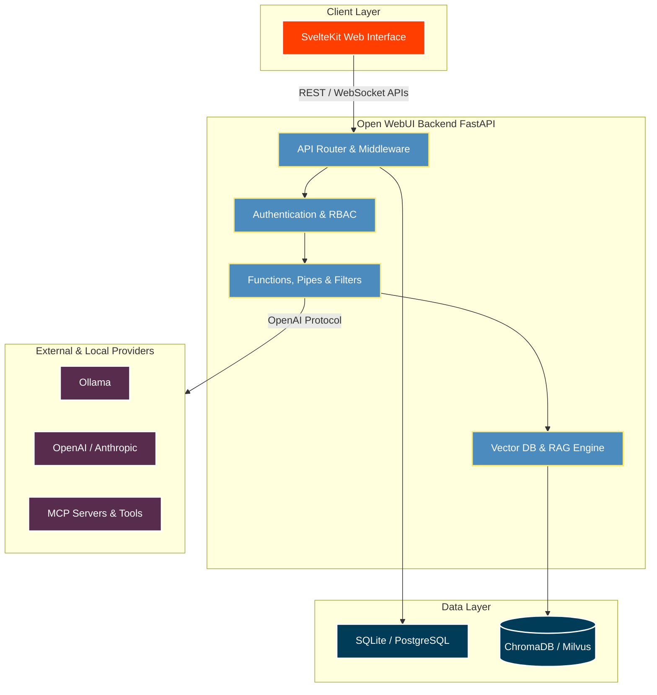
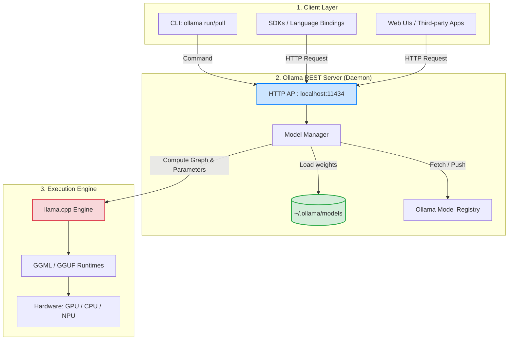

#### 使用 Docker 部署 Open WebUI 介面 與 Ollama 語言模型介面
#### 1. 在 Ubuntu 上安裝 Docker Engine
##### 1-1. 移除舊版本 Docker Engine
```sh
sudo apt remove $(dpkg --get-selections docker.io docker-compose docker-compose-v2 docker-doc podman-docker containerd runc | cut -f1)
```
##### 1-2. 使用 ```apt``` 軟體來源進行安裝
(1) 設定 Docker 的 ```apt``` 儲存庫
```sh
# Add Docker's official GPG key:
sudo apt update
sudo apt install ca-certificates curl
sudo install -m 0755 -d /etc/apt/keyrings
sudo curl -fsSL https://download.docker.com/linux/ubuntu/gpg -o /etc/apt/keyrings/docker.asc
sudo chmod a+r /etc/apt/keyrings/docker.asc

# Add the repository to Apt sources:
sudo tee /etc/apt/sources.list.d/docker.sources <<EOF
Types: deb
URIs: https://download.docker.com/linux/ubuntu
Suites: $(. /etc/os-release && echo "${UBUNTU_CODENAME:-$VERSION_CODENAME}")
Components: stable
Signed-By: /etc/apt/keyrings/docker.asc
EOF

# Update system packages
sudo apt update
```
<br>(2) 安裝 Docker 軟體套件

```sh
# Install docker
sudo apt install docker-ce docker-ce-cli containerd.io docker-buildx-plugin docker-compose-plugin

# start services
sudo systemctl enable docker
sudo systemctl status docker
sudo systemctl start docker
```

<br>(3) 透過執行 hello-world 鏡像檔來驗證安裝是否成功

```sh
sudo docker run hello-world
```
#### 2. 安裝 NVIDIA 容器工具套件
##### 2-1.  安裝 NVIDIA 容器工具套件
```sh
sudo apt-get update && sudo apt-get install -y --no-install-recommends curl gnupg2
```
##### 2-2. 設定軟體來源儲存庫
```sh
# Configure the production repository
curl -fsSL https://nvidia.github.io/libnvidia-container/gpgkey | sudo gpg --dearmor -o /usr/share/keyrings/nvidia-container-toolkit-keyring.gpg && curl -s -L https://nvidia.github.io/libnvidia-container/stable/deb/nvidia-container-toolkit.list | sed 's#deb https://#deb [signed-by=/usr/share/keyrings/nvidia-container-toolkit-keyring.gpg] https://#g' | sudo tee /etc/apt/sources.list.d/nvidia-container-toolkit.list

# configure the repository to use experimental packages
sudo sed -i -e '/experimental/ s/^#//g' /etc/apt/sources.list.d/nvidia-container-toolkit.list
```
##### 2-3. 從儲存庫更新軟體套件列表
```sh
sudo apt-get update
```
##### 2-4. 安裝 NVIDIA 容器工具套件
```sh
export NVIDIA_CONTAINER_TOOLKIT_VERSION=1.18.1-1
sudo apt-get install -y nvidia-container-toolkit=${NVIDIA_CONTAINER_TOOLKIT_VERSION} nvidia-container-toolkit-base=${NVIDIA_CONTAINER_TOOLKIT_VERSION} libnvidia-container-tools=${NVIDIA_CONTAINER_TOOLKIT_VERSION} libnvidia-container1=${NVIDIA_CONTAINER_TOOLKIT_VERSION}
```
##### 2-5. 配置 Docker 相關設定
```sh
sudo nvidia-ctk runtime configure --runtime=docker
sudo systemctl restart docker
```
#### 3. 藉由 ```git``` 軟體取得 Open WebUI 儲存庫
```sh
git clone https://github.com/open-webui/open-webui.git
cd open-webui
cp .env.example .env
docker network create web-app-bridge
```
#### 4. 使用 docker-compose 啟動 Open WebUI 容器服務
```sh
# The default is pure CPU calculation:
docker compose -f docker-compose.yaml up -d

# To use Nvidia GPU acceleration, add the `docker-compose.gpu.yaml` file:
docker compose -f docker-compose.yaml -f docker-compose.gpu.yaml up -d

# Ollama's API servers are only accessible through the Open WebUI. If you have other services that need to use Ollama, please use this command to start an additional API server:
docker compose -f docker-compose.yaml -f docker-compose.gpu.yaml -f docker-compose.api.yaml up -d
```
##### 4-1. 可將 ```docker-compose.yaml```、```docker-compose.gpu.yaml```、```docker-compose.api.yaml``` 三個檔案的內容實際上可以重寫並合併到一個單獨的 ```docker-compose.yml``` 檔案中，範例如下：
```yml
services:
  ollama:
    volumes:
      - ollama:/root/.ollama
    container_name: ollama
    pull_policy: always
    tty: true
    restart: unless-stopped
    image: ollama/ollama:${OLLAMA_DOCKER_TAG-latest}
    # Expose Ollama API outside the container stack
    ports:
      - ${OLLAMA_WEBAPI_PORT-11434}:11434
    # GPU support
    deploy:
      resources:
        reservations:
          devices:
            - driver: ${OLLAMA_GPU_DRIVER-nvidia}
              count: ${OLLAMA_GPU_COUNT-1}
              capabilities:
                - gpu

  open-webui:
    build:
      context: .
      dockerfile: Dockerfile
    image: ghcr.io/open-webui/open-webui:${WEBUI_DOCKER_TAG-main}
    container_name: open-webui
    volumes:
      - open-webui:/app/backend/data
    depends_on:
      - ollama
    ports:
      - ${OPEN_WEBUI_PORT-3000}:8080
    environment:
      - 'OLLAMA_BASE_URL=http://ollama:11434'
      - 'WEBUI_SECRET_KEY='
    extra_hosts:
      - host.docker.internal:host-gateway
    restart: unless-stopped

volumes:
  ollama: {}
  open-webui: {}

networks:
  web_app_bridge:
    driver: bridge
```
#### 5. 取得大型語言模型（Large Language Model, LLM）
```sh
# ex.
sudo docker exec -it ollama ollama pull qwen3-vl:latest
sudo docker exec -it ollama ollama pull qwen3.5:latest
sudo docker exec -it ollama ollama pull llama3.1:latest
sudo docker exec -it ollama ollama pull gemma:7b
```
#### 6. 檢查容器狀態
##### 6-1. 列出運行容器 ID 或名稱
```sh
sudo docker ps
```
##### 6-2. 停止容器
```sh
# 停止單一容器
sudo docker stop <CONTAINER_ID_OR_NAME>

# 停止 docker-compose.yaml 已運行之容器
sudo docker compose stop
```
#### 7. 更新容器
##### 7-1. 取得最新的 ```GitHub``` 儲存庫資料
```sh
sudo git pull origin main
```
##### 7-2. 提取最新 docker 
```sh
sudo docker compose pull
```
##### 7-3. 重新建立容器
```sh
sudo docker compose up -d
```
##### 7-4. 刪除舊影像檔資料
```sh
sudo docker image prune -f
```
#### + DEMO +
##### **ollama in Docker Desktop state**


##### **ollama open webui (chatapp)**




#### + 架構圖 +
**Core Open WebUI Architecture**


<br><b>Core Ollama Architecture</b>



#### + reference +
<ol>
<li><a href="https://ivonblog.com/posts/ollama-llm-docker/" target="_blank">Linux用docker-compose部署Open WebUI + Ollama語言模型網頁界面</a></li>
<li><a href="https://docs.docker.com/engine/install/ubuntu/" target="_blank">Install Docker Engine on Ubuntu</a></li>
<li><a href="https://docs.nvidia.com/datacenter/cloud-native/container-toolkit/latest/install-guide.html" target="_blank">Installing the NVIDIA Container Toolkit</a></li>
</ol>