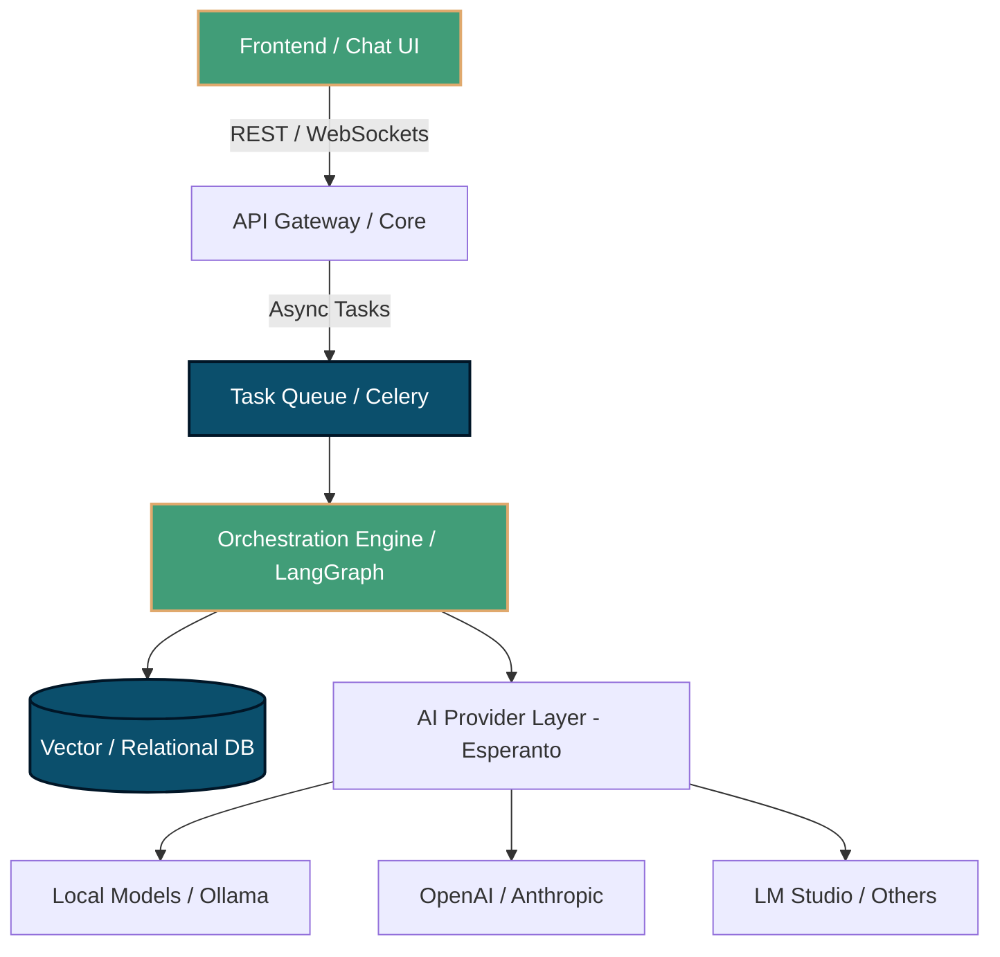
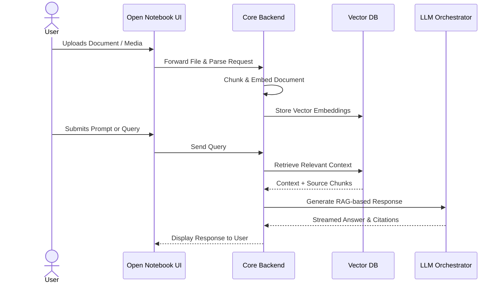

#### 使用 Docker 部署 Open Notebook 介面 與 Ollama 語言模型介面
Open Notebook 的最佳安裝方式是透過 Docker Compose 來佈署
#### 一、 準備工作
1. **必備硬體與軟體**：電腦需至少 4GB 記憶體，並安裝好 Docker 軟體 Open Notebook 完整部署教程：打造私有化NotebookLM 替代方案。<br>
2. **API Key 準備**：準備一組 AI 服務商的 API 金鑰（如 OpenAI、Anthropic Claude、或 Google Gemini），以便讓 AI 讀取與處理文件 Open Notebook 完整部署教程：打造私有化NotebookLM 替代方案。<br>
#### 二、 安裝與啟動步驟
**1. 建立專案資料夾**<br>
進入在終端機（Terminal）或命令提示字元（cmd）中執行以下指令：
```sh
mkdir open-notebook
cd open-notebook
```
**2. 建立Docker Networks**
```sh
sudo docker create network web-app-bridge
```
**3. 建立 ```docker-compose.yml``` 檔案**<br>
使用文字編輯器建立一個名為 ```docker-compose.yml``` 的檔案，貼入以下標準配置範本
```yaml
services:
  ollama:
    volumes:
      - ollama:/root/.ollama
    container_name: ollama
    pull_policy: always
    tty: true
    restart: unless-stopped
    image: ollama/ollama:${OLLAMA_DOCKER_TAG-latest}
    # Expose Ollama API outside the container stack
    ports:
      - 11434:11434
    ## GPU support
    # deploy:
    #   resources:
    #     reservations:
    #       devices:
    #         - driver: ${OLLAMA_GPU_DRIVER-nvidia}
    #           count: ${OLLAMA_GPU_COUNT-1}
    #           capabilities:
    #             - gpu
    #extra_hosts:
    #  - host.docker.internal:host-gateway
    networks:
      - web-app-bridge

  surrealdb:
    image: surrealdb/surrealdb:v2
    container_name: surrealdb
    command: start --log info --user root --pass root rocksdb:/mydata/mydatabase.db
    user: root  # Required for bind mounts on Linux
    ports:
      - "8000:8000"
      #- ${SURREALDB-8000}:8000
    volumes:
      - ./surreal_data:/mydata
    environment:
      - SURREAL_EXPERIMENTAL_GRAPHQL=true
    restart: always
    pull_policy: always
    networks:
      - web-app-bridge

  speaches:
    image: ghcr.io/speaches-ai/speaches:latest-cpu
    container_name: speaches
    ports:
      - "8969:8000"
      #- ${SPEACHES-8969}:8000 
    volumes:
      - hf-hub-cache:/home/ubuntu/.cache/huggingface/hub
    restart: unless-stopped
    networks:
      - web-app-bridge
    # For GPU acceleration, use: ghcr.io/speaches-ai/speaches:latest-cuda
    # and add GPU device mapping (see docs)

  open_notebook:
    image: lfnovo/open_notebook:v1-latest
    container_name: open_notebook
    ports:
      - "8502:8502"  # Web UI
      - "5055:5055"  # REST API
    environment:
      # REQUIRED: Change this to your own secret string
      - OPEN_NOTEBOOK_ENCRYPTION_KEY=change-me-to-a-secret-string

      # Database connection
      - SURREAL_URL=ws://surrealdb:8000/rpc
      - SURREAL_USER=root
      - SURREAL_PASSWORD=root
      - SURREAL_NAMESPACE=open_notebook
      - SURREAL_DATABASE=open_notebook

      # Ollama connection (optional, can also configure via UI)
      - OLLAMA_BASE_URL=http://ollama:11434
    volumes:
      - ./notebook_data:/app/data
    depends_on:
      - surrealdb
      - ollama
    restart: always
    pull_policy: always
    extra_hosts:
      - host.docker.internal:host-gateway
    networks:
      - web-app-bridge

volumes:
  ollama: {}
  hf-hub-cache: {}

networks:
  web-app-bridge:
    external: true
```
**4. 啟動容器**<br>
在 ```docker-compose.yml``` 所在目錄下執行啟動指令
```sh
docker compose up -d
```

#### + 架構圖 +
<b>1. System Architecture (Component Diagram)</b>



<br><b>2. Information Ingestion & Processing Flow (Sequence Diagram)</b>



#### + reference +
<ol>
<li><a href="https://www.find.org.tw/tech_obser/browse/516a1e433a0435028da95f53d2e01d41" target="_blank">Open Notebook：不想讓 Google 看光你的研究？這個開源專案是你的解答</a></li>
<li><a href="https://www.open-notebook.ai/" target="_blank">Open Notebook</a></li>
<li><a href="https://github.com/lfnovo/open-notebook" target="_blank">(GitHub)open-notebook</a></li>
</ol>