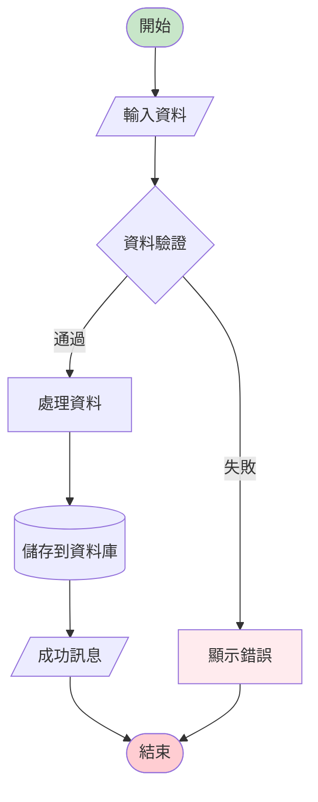
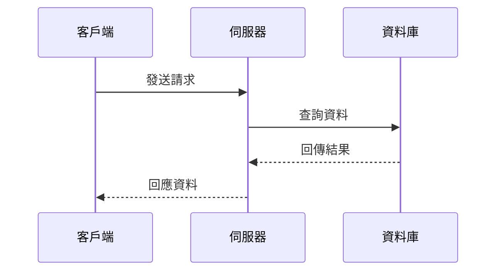

#### + reference +
<ol>
<li><a href="" target="_blank"></a></li>
<li><a href="" target="_blank"></a></li>
<li><a href="" target="_blank"></a></li>
<li><a href="" target="_blank"></a></li>
<li><a href="" target="_blank"></a></li>
<li><a href="" target="_blank"></a></li>
<li><a href="" target="_blank"></a></li>
<li><a href="" target="_blank"></a></li>
</ol>

#### + table +
| Git 指令 | 指令說明 | 註記 |
| :--- | :--- | :--- |
| `````` |  |  |

#### + mermaid +
##### 流程圖 (Flowchart)


##### 時序圖 (Sequence Diagram)
